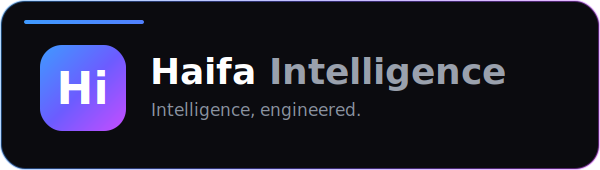

<div align="center">



# ✨ Haifa Intelligence

**Intelligence, engineered.**

The website & creative platform for **Haifa Intelligence** — an AI & ML studio.
Showcasing our work, services, model shelf, and a public **AI Studio** that turns
a prompt into a styled image on our own GPU.

<br/>


[Features](#-features) · [Quick start](#-quick-start) · [Project structure](#-project-structure) · [Roadmap](#-roadmap)

</div>

---

## 🧠 About

Haifa Intelligence is an AI & ML studio. We build machine-learning models, web &
mobile products, and generative image / video work for teams who want to move fast
and look sharp.

This repository is the studio's **website** — a polished, heavily-animated Next.js
app — plus the **AI Studio**, a public image-generation experience that runs on our
own local GPU pipeline (no paid cloud API).

Design language: *calm-but-premium*, high motion (smooth scroll + scroll reveals +
parallax), light **and** dark themes (default dark).

---

## 🎨 Features

- **AI Studio** — type a prompt, pick a curated **style** (no model jargon), tune
  detail & resolution, and generate a real image. Backed by a local **ComfyUI**
  Krea-2 pipeline; styles map internally to LoRAs + trigger words.
  - 10 curated styles · steps (8–16) & resolution (1–5 MP) sliders with live
    time-cost hints · aspect-ratio control · built-in prompt-optimizer hook.
  - **Live queue & progress** — jobs enqueue without blocking; the UI shows real
    queue position ("N ahead") then step-by-step progress, fed by the home bridge's
    WebSocket to ComfyUI.
  - **Style gallery** — two real outputs per style on `/studio`, plus a showcase
    marquee on the homepage. Images are optimized WebP with blur-up placeholders.
- **Portfolio & services** — work case studies, a shelf of AI models, services,
  and a founder page.
- **Premium motion** — Lenis smooth scroll, Framer Motion reveals & parallax.
- **Theming** — light/dark with a tiny custom, dependency-free theme system
  (anti-FOUC inline script + `useTheme` hook).
- **Lead capture** — a contact flow (stub route now; NestJS API later).

---

## 🧱 Stack

- **Next.js 16** (App Router, TypeScript, Turbopack) — `apps/web`
- **Tailwind CSS v4** + **shadcn/ui** + **lucide-react**
- **Framer Motion** (reveals, parallax) + **Lenis** (smooth scroll)
- Custom **light/dark theme** system with CSS-variable design tokens
- **ComfyUI** (Krea-2 turbo + LoRAs) as the AI Studio image backend
- npm workspaces + **Turborepo** monorepo (so a NestJS `apps/api` drops in later)

---

## 🚀 Quick start

```bash
# from the repo root
npm install
npm run dev          # turbo runs every app's dev task
# or just the web app:
npm run web
```

Open <http://localhost:3000>.

```bash
npm run build        # production build (type-checks everything)
```

### AI Studio (optional, for image generation)

The studio runs on a home GPU. The web app talks to a small **bridge** (`apps/api`)
that fronts **ComfyUI** — the bridge holds a WebSocket to ComfyUI so it can report
live per-step progress and queue position.

```
browser → Next API → STUDIO_BRIDGE_URL → bridge (apps/api) → ComfyUI (localhost)
```

Run all three at home:

```bash
# 1) ComfyUI (listen so the bridge can reach it)
python main.py --listen 0.0.0.0 --port 8188

# 2) the bridge (defaults: COMFYUI_URL=127.0.0.1:8188, PORT=8189)
npm run start --workspace api      # or: npm run dev --workspace api

# 3) tell the web app where the bridge is
cp apps/web/.env.example apps/web/.env.local
# STUDIO_BRIDGE_URL=http://127.0.0.1:8189            (local)
# STUDIO_BRIDGE_URL=https://<your-tunnel>            (Cloudflare Tunnel → bridge, for cloud)
```

For the deployed site, point a Cloudflare Tunnel at the **bridge** (port 8189) and set
`STUDIO_BRIDGE_URL` on Vercel to that URL. Without a reachable bridge, the studio shows
a friendly "GPU offline" message.

---

## 📁 Project structure

```
apps/api                   Studio bridge (runs at home): WS to ComfyUI for live
                           progress + queue, /enqueue + /status. No dependencies.
apps/web                   Next.js frontend (the current deliverable)
  app/                     routes: / · /work · /work/[slug] · /services
                           /models · /founder · /contact · /studio
    api/contact            lead-capture stub
    api/studio/generate    enqueue a job on the bridge
    api/studio/status      poll queue position + progress + result
  components/
    motion/                SmoothScroll, Reveal, Parallax, Marquee
    layout/                Navbar, MobileMenu, Footer, Logo
    sections/              home + page sections (incl. studio client)
    theme/                 custom theme script + useTheme hook
    shared/                cards, headings, aurora, icons
    ui/                    shadcn primitives
  lib/
    data/                  typed content: services, projects, models, styles…
    comfy/                 ComfyUI client + captured Krea-2 workflow
assets/                    repo media (logo/banner)
packages/                  reserved (shared ui/config, NestJS api later)
```

Content lives in `apps/web/lib/data/*` — adding a project, model, video, or studio
style is a single typed array entry, no JSX.

---

## 🗺️ Roadmap

- [ ] **`apps/api`** — NestJS lead capture, email, Postgres + Prisma (the contact
      form currently posts to a stub route).
- [x] **Studio queue & live progress** — bridge surfaces ComfyUI's serial queue
      (position) and real per-step progress; jobs enqueue without blocking.
- [ ] **Studio hardening** — per-IP rate limits + daily quota, a shared-secret between
      Vercel and the bridge, prompt-moderation logging.
- [ ] **Prompt optimizer** — expose the workflow's built-in prompt refiner in the UI.
- [ ] **Selective training** — train the studio on a user's own subject/style.
- [ ] Real media (project images, reels, founder photos), CMS / admin.

---

<div align="center">

Built by **[Danial Dirar](https://github.com/Danial-Dirar)** · Dhaka, Bangladesh · Remote worldwide

© Haifa Intelligence — All rights reserved.

</div>
